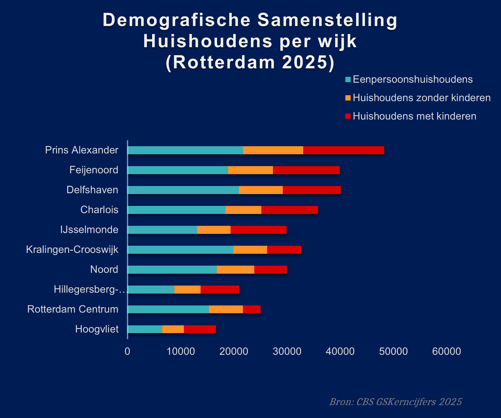

  
# Demo-Wijk-2025-Rotterdam 🎡

[NL] Analyse van CBS StatLine-kerncijfers wijken en buurten (2025) om de huishoudenssamenstelling van de top 10 grootste Rotterdamse wijken in kaart te brengen voor strategisch buurtwerk.

[EN] Analysis of CBS StatLine neighborhood data (2025) to map household compositions across the top 10 most populated Rotterdam districts for strategic community work.

---

## Visualisatie / Visualization

## Over dit project / About this project
* **Data Source:** [CBS StatLine 2025](https://cbs.nl)
* **Methodology:** De data is gefilterd op de 10 wijken met de meeste inwoners om de meest significante trends helder weer te geven. / Data was filtered for the 10 most populated districts to highlight the most significant trends.
### Visualisatie Focus / Visualization Focus
* **NL:** De grafiek richt zich op de **top 10 meest bevolkte wijken** van Rotterdam. Dit zorgt voor een helder en overzichtelijk beeld van de grootste demografische trends in de stad.
* **EN:** This visualization focuses on the **top 10 most populated districts** in Rotterdam to ensure a clear and impactful overview of the city's largest demographic trends.
## Belangrijkste Inzicht / Key Insight
* **NL:** Uit de data blijkt dat in bijna alle grote wijken **eenpersoonshuishoudens** de grootste groep vormen. Vooral in **Prins Alexander** is dit volume zeer hoog, wat wijst op een grote behoefte aan specifieke voorzieningen voor alleenwonenden in deze gebieden.
* **EN:** The data reveals that **single-person households** are the dominant group in almost all major districts. This volume is particularly high in **Prins Alexander**, highlighting a significant demand for urban services tailored to single residents in these areas.
* **NL:** Daarnaast valt op dat wijken zoals **Delfshaven** en **Feijenoord** relatief veel huishoudens met kinderen hebben. Dit biedt waardevolle informatie voor het plannen van gezinsgerichte buurtactiviteiten en voorzieningen.
* **EN:** Furthermore, districts like **Delfshaven** and **Feijenoord** show a relatively high number of households with children. This provides valuable insights for planning family-oriented community activities and facilities.
